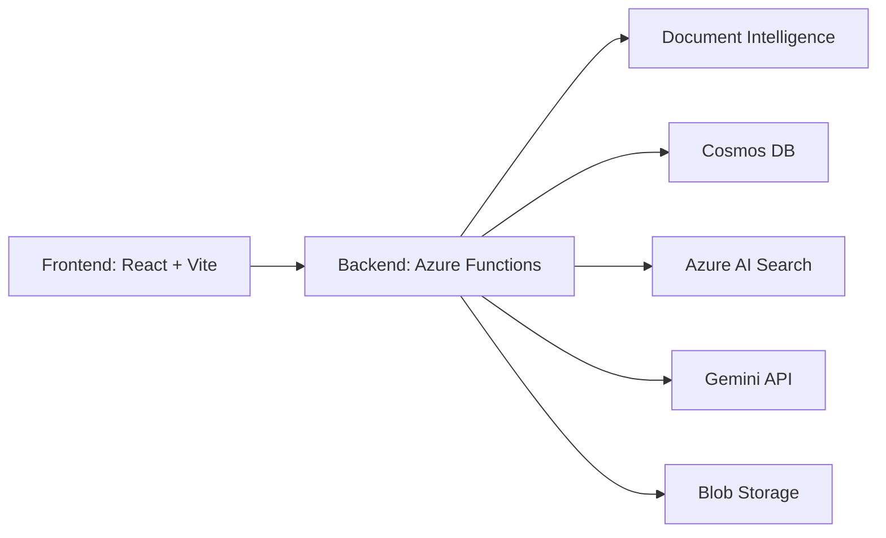
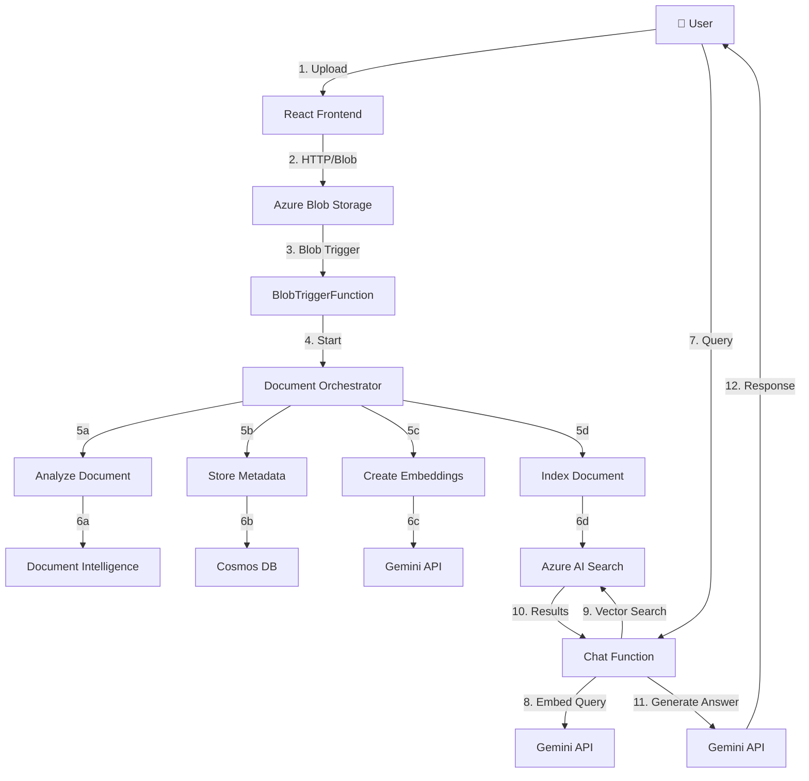
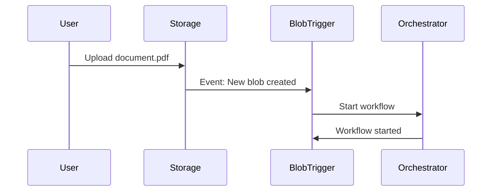
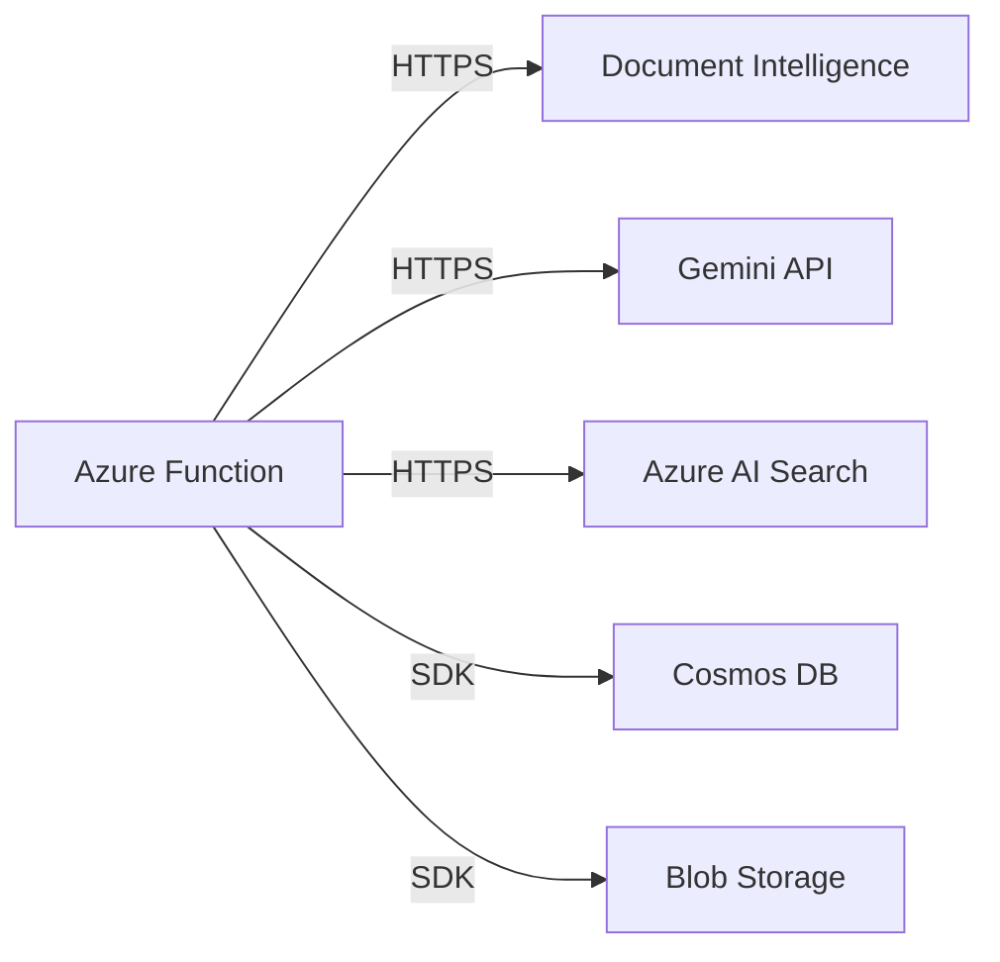

# 📘 Complete Implementation Guide
## Azure Document Classification & RAG System

> **Comprehensive guide to implement, connect, trigger, and deploy the entire system**

---

## 📋 Table of Contents

1. [System Overview](#1-system-overview)
2. [Architecture Deep Dive](#2-architecture-deep-dive)
3. [Prerequisites & Installation](#3-prerequisites--installation)
4. [Azure Resources Setup](#4-azure-resources-setup)
5. [Backend Implementation](#5-backend-implementation)
6. [Frontend Implementation](#6-frontend-implementation)
7. [How Triggers Work](#7-how-triggers-work)
8. [How Connections Work](#8-how-connections-work)
9. [Testing Guide](#9-testing-guide)
10. [Deployment Guide](#10-deployment-guide)
11. [Troubleshooting](#11-troubleshooting)
12. [Advanced Topics](#12-advanced-topics)

---

## 1. System Overview

### 1.1 What This System Does

This is a **production-ready RAG (Retrieval-Augmented Generation)** system that:

- 📄 **Processes Documents**: Automatically extracts text from PDFs, images, and various document formats
- 🔍 **Semantic Search**: Uses vector embeddings for intelligent document search
- 💬 **AI-Powered Chat**: Allows users to ask questions and get answers from their documents
- 📊 **Metadata Management**: Tracks and stores document information
- 🎯 **Selective Querying**: Filter conversations by specific documents
- ⚡ **Serverless & Scalable**: Built on Azure Functions for automatic scaling

### 1.2 Real-World Applications

| Industry | Use Case |
|----------|----------|
| **Legal** | Search contracts, case files, legal documents |
| **Healthcare** | Query medical records, research papers, patient files |
| **Finance** | Analyze invoices, financial reports, statements |
| **Education** | Create interactive study materials, research assistance |
| **Business** | Document management, knowledge base, compliance |

### 1.3 Key Technologies



---

## 2. Architecture Deep Dive

### 2.1 High-Level Architecture



### 2.2 Component Breakdown

#### **Frontend Layer**
- **Technology**: React 18 + Vite
- **Components**:
  - `App.jsx`: Main application shell
  - `DocumentUpload.jsx`: File upload interface
  - `ChatInterface.jsx`: Chat UI with message history
  - `FileSelector.jsx`: Document filtering dropdown
- **Purpose**: User interface for document upload and chat

#### **Backend Layer (Azure Functions)**

| Function | Type | Purpose |
|----------|------|---------|
| `BlobTriggerFunction` | Blob Trigger | Automatically triggers when file uploaded |
| `UploadFunction` | HTTP Trigger | Alternative upload endpoint |
| `DocumentOrchestrator` | Orchestrator | Coordinates entire workflow |
| `AnalyzeDocumentActivity` | Activity | Extracts text using Document Intelligence |
| `StoreMetadataActivity` | Activity | Saves document info to Cosmos DB |
| `CreateEmbeddingsActivity` | Activity | Generates vector embeddings |
| `IndexDocumentActivity` | Activity | Stores in Azure AI Search |
| `ChatFunction` | HTTP Trigger | Handles user queries |
| `GetDocumentsFunction` | HTTP Trigger | Lists uploaded documents |

#### **Storage Layer**

| Service | Purpose | Data Stored |
|---------|---------|-------------|
| **Blob Storage** | File storage | Original PDF/document files |
| **Cosmos DB** | NoSQL database | Document metadata, processing status |
| **Azure AI Search** | Vector search | Document chunks + embeddings |

#### **AI Layer**

| Service | Purpose | API Used |
|---------|---------|----------|
| **Document Intelligence** | Text extraction / OCR | Azure Cognitive Services |
| **Gemini API** | Embeddings generation | `text-embedding-004` |
| **Gemini API** | Answer generation | `gemini-1.5-flash` |

---

## 3. Prerequisites & Installation

### 3.1 System Requirements

- **Operating System**: Linux (Ubuntu 20.04+), macOS, or Windows with WSL2
- **RAM**: Minimum 8GB (16GB recommended)
- **Disk Space**: 10GB free space
- **Internet**: Required for Azure services and API calls

### 3.2 Required Software

#### Install .NET 8 SDK

```bash
# Ubuntu/Debian
wget https://packages.microsoft.com/config/ubuntu/22.04/packages-microsoft-prod.deb -O packages-microsoft-prod.deb
sudo dpkg -i packages-microsoft-prod.deb
rm packages-microsoft-prod.deb

sudo apt-get update
sudo apt-get install -y dotnet-sdk-8.0

# Verify installation
dotnet --version
# Expected: 8.0.x
```

#### Install Node.js 18+

```bash
# Ubuntu/Debian
curl -fsSL https://deb.nodesource.com/setup_18.x | sudo -E bash -
sudo apt-get install -y nodejs

# Verify installation
node --version  # Expected: v18.x.x or higher
npm --version   # Expected: v9.x.x or higher
```

#### Install Azure Functions Core Tools

```bash
npm install -g azure-functions-core-tools@4 --unsafe-perm true

# Verify installation
func --version
# Expected: 4.x.x
```

#### Install Azure CLI

```bash
# Ubuntu/Debian
curl -sL https://aka.ms/InstallAzureCLIDeb | sudo bash

# Verify installation
az --version

# Login to Azure
az login
# This will open a browser window for authentication
```

#### Install Azurite (Local Storage Emulator)

```bash
npm install -g azurite

# Verify installation
azurite --version
```

### 3.3 Azure Subscription

1. **Get Azure Account**:
   - Visit [Azure Portal](https://portal.azure.com/)
   - Sign up for free trial (includes $200 credit)
   - Or use existing subscription

2. **Verify Access**:
   ```bash
   az account show
   ```

### 3.4 Google Gemini API Key

1. **Get API Key**:
   - Visit [Google AI Studio](https://aistudio.google.com/app/apikey)
   - Sign in with Google account
   - Click "Create API Key"
   - Copy and save the key securely

2. **Free Tier Limits**:
   - 15 requests per minute
   - 1,500 requests per day
   - No credit card required

---

## 4. Azure Resources Setup

### 4.1 Resource Planning

**Estimated Costs** (Basic tier):
- Storage Account: ~$1-5/month
- Cosmos DB: ~$5-10/month
- Document Intelligence: ~$5-15/month
- Azure AI Search: ~$75/month (Basic tier)
- Function App: Consumption plan ~$0-10/month
- **Total**: ~$90-115/month

> 💡 **Tip**: Use Free tier where available and delete resources when not in use to save costs.

### 4.2 Step-by-Step Azure Setup

#### Set Environment Variables

```bash
# Define your project variables
export RESOURCE_GROUP="rg-doc-classification"
export LOCATION="eastus"
export STORAGE_ACCOUNT="docstorage$(date +%s)"
export COSMOS_ACCOUNT="doc-cosmos-$(date +%s)"
export DOC_INTELLIGENCE="doc-intelligence-$(date +%s)"
export SEARCH_SERVICE="doc-search-$(date +%s)"
export FUNCTION_APP="doc-functions-$(date +%s)"

# Save these for later
echo "RESOURCE_GROUP=$RESOURCE_GROUP" > .env
echo "STORAGE_ACCOUNT=$STORAGE_ACCOUNT" >> .env
echo "COSMOS_ACCOUNT=$COSMOS_ACCOUNT" >> .env
# ... add others
```

#### Create Resource Group

```bash
az group create \
  --name $RESOURCE_GROUP \
  --location $LOCATION

# Verify
az group show --name $RESOURCE_GROUP
```

#### Create Storage Account

```bash
# Create storage account
az storage account create \
  --name $STORAGE_ACCOUNT \
  --resource-group $RESOURCE_GROUP \
  --location $LOCATION \
  --sku Standard_LRS \
  --kind StorageV2

# Create blob container
az storage container create \
  --name documents \
  --account-name $STORAGE_ACCOUNT

# Get connection string (SAVE THIS!)
STORAGE_CONNECTION=$(az storage account show-connection-string \
  --name $STORAGE_ACCOUNT \
  --resource-group $RESOURCE_GROUP \
  --query connectionString -o tsv)

echo "Storage Connection String: $STORAGE_CONNECTION"
```

#### Create Cosmos DB

```bash
# Create Cosmos DB account (takes 5-10 minutes)
az cosmosdb create \
  --name $COSMOS_ACCOUNT \
  --resource-group $RESOURCE_GROUP \
  --locations regionName=$LOCATION \
  --default-consistency-level Session

# Create database
az cosmosdb sql database create \
  --account-name $COSMOS_ACCOUNT \
  --resource-group $RESOURCE_GROUP \
  --name DocumentClassificationDB

# Create container with partition key
az cosmosdb sql container create \
  --account-name $COSMOS_ACCOUNT \
  --resource-group $RESOURCE_GROUP \
  --database-name DocumentClassificationDB \
  --name documents \
  --partition-key-path "/id" \
  --throughput 400

# Get connection string (SAVE THIS!)
COSMOS_CONNECTION=$(az cosmosdb keys list \
  --name $COSMOS_ACCOUNT \
  --resource-group $RESOURCE_GROUP \
  --type connection-strings \
  --query "connectionStrings[0].connectionString" -o tsv)

echo "Cosmos Connection String: $COSMOS_CONNECTION"
```

#### Create Document Intelligence

```bash
# Create Document Intelligence resource
az cognitiveservices account create \
  --name $DOC_INTELLIGENCE \
  --resource-group $RESOURCE_GROUP \
  --kind FormRecognizer \
  --sku S0 \
  --location $LOCATION

# Get endpoint (SAVE THIS!)
DOC_ENDPOINT=$(az cognitiveservices account show \
  --name $DOC_INTELLIGENCE \
  --resource-group $RESOURCE_GROUP \
  --query properties.endpoint -o tsv)

# Get key (SAVE THIS!)
DOC_KEY=$(az cognitiveservices account keys list \
  --name $DOC_INTELLIGENCE \
  --resource-group $RESOURCE_GROUP \
  --query key1 -o tsv)

echo "Document Intelligence Endpoint: $DOC_ENDPOINT"
echo "Document Intelligence Key: $DOC_KEY"
```

#### Create Azure AI Search

```bash
# Create AI Search service
az search service create \
  --name $SEARCH_SERVICE \
  --resource-group $RESOURCE_GROUP \
  --sku Basic \
  --location $LOCATION \
  --partition-count 1 \
  --replica-count 1

# Get endpoint
SEARCH_ENDPOINT="https://${SEARCH_SERVICE}.search.windows.net"

# Get admin key (SAVE THIS!)
SEARCH_KEY=$(az search admin-key show \
  --service-name $SEARCH_SERVICE \
  --resource-group $RESOURCE_GROUP \
  --query primaryKey -o tsv)

echo "Search Endpoint: $SEARCH_ENDPOINT"
echo "Search Admin Key: $SEARCH_KEY"
```

#### Summary - Save All Credentials

Create a file `credentials.txt` (DO NOT COMMIT THIS):

```bash
cat > credentials.txt << EOF
=== Azure Resources ===
Resource Group: $RESOURCE_GROUP
Storage Account: $STORAGE_ACCOUNT
Storage Connection: $STORAGE_CONNECTION

Cosmos Account: $COSMOS_ACCOUNT
Cosmos Connection: $COSMOS_CONNECTION

Document Intelligence Endpoint: $DOC_ENDPOINT
Document Intelligence Key: $DOC_KEY

Search Endpoint: $SEARCH_ENDPOINT
Search Admin Key: $SEARCH_KEY
EOF

echo "Credentials saved to credentials.txt - KEEP THIS SECURE!"
```

---

## 5. Backend Implementation

### 5.1 Project Structure

```
AzureFunctions/DocumentClassification/
├── Models/
│   ├── DocumentInfo.cs          # Document reference model
│   ├── DocumentMetadata.cs      # Cosmos DB document model
│   └── EmbeddedDocument.cs      # Search index model
├── Services/
│   └── GeminiService.cs         # Gemini API client
├── BlobTriggerFunction.cs       # Entry point for uploads
├── UploadFunction.cs            # HTTP upload endpoint
├── DocumentOrchestrator.cs      # Workflow coordinator
├── AnalyzeDocumentActivity.cs   # Text extraction
├── StoreMetadataActivity.cs     # Metadata storage
├── IndexDocumentActivity.cs     # Search indexing
├── ChatFunction.cs              # Query endpoint
├── GetDocumentsFunction.cs      # List documents
├── Program.cs                   # Dependency injection
├── host.json                    # Function app config
└── local.settings.json          # Local configuration
```

### 5.2 Clone or Create Project

```bash
# If cloning existing repository
git clone <your-repo-url>
cd DocumentClassificationProject

# OR create new project
mkdir -p DocumentClassificationProject/AzureFunctions/DocumentClassification
cd DocumentClassificationProject/AzureFunctions/DocumentClassification

# Initialize Functions project
func init . --worker-runtime dotnet-isolated --target-framework net8.0
```

### 5.3 Install NuGet Packages

```bash
cd AzureFunctions/DocumentClassification

# Add all required packages
dotnet add package Microsoft.Azure.Functions.Worker.Extensions.DurableTask
dotnet add package Microsoft.Azure.Functions.Worker.Extensions.Storage.Blobs
dotnet add package Microsoft.Azure.Functions.Worker.Extensions.Http
dotnet add package Azure.AI.FormRecognizer
dotnet add package Microsoft.Azure.Cosmos
dotnet add package Azure.Search.Documents
dotnet add package System.Net.Http.Json
dotnet add package Newtonsoft.Json

# Restore and build
dotnet restore
dotnet build
```

### 5.4 Configure local.settings.json

Create `/AzureFunctions/DocumentClassification/local.settings.json`:

```json
{
  "IsEncrypted": false,
  "Values": {
    "AzureWebJobsStorage": "UseDevelopmentStorage=true",
    "FUNCTIONS_WORKER_RUNTIME": "dotnet-isolated",
    
    "CosmosDBConnection": "YOUR_COSMOS_CONNECTION_STRING",
    "CosmosDBDatabaseName": "DocumentClassificationDB",
    "CosmosDBContainerName": "documents",
    
    "DocumentIntelligenceEndpoint": "YOUR_DOC_INTELLIGENCE_ENDPOINT",
    "DocumentIntelligenceKey": "YOUR_DOC_INTELLIGENCE_KEY",
    
    "SearchServiceEndpoint": "YOUR_SEARCH_ENDPOINT",
    "SearchServiceAdminKey": "YOUR_SEARCH_ADMIN_KEY",
    
    "GeminiApiKey": "YOUR_GEMINI_API_KEY",
    
    "StorageConnectionString": "YOUR_STORAGE_CONNECTION_STRING"
  },
  "Host": {
    "CORS": "*"
  }
}
```

**Replace placeholders** with values from Section 4.2.

### 5.5 Key Components Explained

#### GeminiService.cs - AI Integration

This service handles all Gemini API interactions:

```csharp
public class GeminiService
{
    // Generates vector embeddings (768 dimensions)
    public async Task<float[]> GenerateEmbeddingsAsync(string text)
    {
        // Calls: text-embedding-004 model
        // Converts text to numerical vector
        // Used for: Document chunks and user queries
    }

    // Generates AI responses
    public async Task<string> GenerateContentAsync(string prompt)
    {
        // Calls: gemini-1.5-flash model
        // Takes: User query + document context
        // Returns: Natural language answer
    }
}
```

**Why Embeddings?**
- Convert text to numbers (vectors)
- Enable semantic similarity search
- "price" and "cost" are mathematically similar

#### BlobTriggerFunction.cs - Upload Trigger

```csharp
[Function(nameof(BlobTriggerFunction))]
public async Task Run(
    [BlobTrigger("documents/{name}")] Stream blobStream,
    string name)
{
    // AUTOMATICALLY TRIGGERED when file uploaded to "documents" container
    // Starts the DocumentOrchestrator workflow
}
```

#### DocumentOrchestrator.cs - Workflow Manager

```csharp
[Function(nameof(DocumentOrchestrator))]
public async Task<string> RunOrchestrator(
    [OrchestrationTrigger] TaskOrchestrationContext context)
{
    // 1. Call AnalyzeDocumentActivity
    var content = await context.CallActivityAsync<string>(
        nameof(AnalyzeDocumentActivity), documentInfo);
    
    // 2. Call StoreMetadataActivity
    await context.CallActivityAsync(
        nameof(StoreMetadataActivity), metadata);
    
    // 3. Call IndexDocumentActivity (includes embedding creation)
    await context.CallActivityAsync(
        nameof(IndexDocumentActivity), metadata);
    
    return "Success";
}
```

**Benefits of Orchestrator**:
- Ensures sequential execution
- Handles retries automatically
- Maintains state across failures

#### AnalyzeDocumentActivity.cs - Text Extraction

```csharp
[Function(nameof(AnalyzeDocumentActivity))]
public async Task<string> Run([ActivityTrigger] DocumentInfo input)
{
    // Uses Azure Document Intelligence
    // Supports: PDF, JPEG, PNG, TIFF, DOCX, etc.
    // Returns: Extracted text content
    var operation = await client.AnalyzeDocumentFromUriAsync(
        WaitUntil.Completed, "prebuilt-read", blobUri);
    
    return extractedText;
}
```

#### IndexDocumentActivity.cs - Vector Search

```csharp
[Function(nameof(IndexDocumentActivity))]
public async Task Run([ActivityTrigger] DocumentMetadata input)
{
    // 1. Split content into chunks (500 words)
    var chunks = SplitIntoChunks(input.Content);
    
    // 2. Generate embeddings for each chunk
    foreach (var chunk in chunks)
    {
        var embedding = await geminiService.GenerateEmbeddingsAsync(chunk);
        
        // 3. Store in Azure AI Search with vector
        var doc = new EmbeddedDocument
        {
            Content = chunk,
            ContentVector = embedding,
            FileName = input.FileName
        };
        
        await searchClient.IndexDocumentsAsync(docs);
    }
}
```

**Chunking Strategy**:
- Large documents → Multiple small chunks
- Improves search relevance
- Default: 500 words per chunk

#### ChatFunction.cs - Query Handler

```csharp
[Function("Chat")]
public async Task<HttpResponseData> Run(
    [HttpTrigger(AuthorizationLevel.Anonymous, "post")] 
    HttpRequestData req)
{
    // 1. Get user query
    var request = await req.ReadFromJsonAsync<ChatRequest>();
    
    // 2. Generate query embedding
    var queryEmbedding = await geminiService.GenerateEmbeddingsAsync(
        request.Query);
    
    // 3. Vector search in Azure AI Search
    var searchResults = await searchClient.SearchAsync<EmbeddedDocument>(
        request.Query,
        new SearchOptions {
            VectorSearch = queryEmbedding,
            Filter = fileNameFilter,  // Optional
            Top = 5
        });
    
    // 4. Build context from results
    var context = string.Join("\n", searchResults.Select(r => r.Content));
    
    // 5. Generate answer with Gemini
    var prompt = $"Context:\n{context}\n\nQuestion: {request.Query}";
    var answer = await geminiService.GenerateContentAsync(prompt);
    
    return answer;
}
```

---

## 6. Frontend Implementation

### 6.1 Create React App

```bash
cd DocumentClassificationProject

# Create Vite + React project
npm create vite@latest frontend -- --template react
cd frontend

# Install dependencies
npm install
npm install axios

# Project structure
frontend/
├── src/
│   ├── App.jsx              # Main component
│   ├── ChatInterface.jsx    # Chat UI
│   ├── DocumentUpload.jsx   # Upload form
│   ├── FileSelector.jsx     # Document filter
│   ├── config.js            # API configuration
│   └── main.jsx             # Entry point
├── package.json
└── vite.config.js
```

### 6.2 Configure API Endpoint

Create `src/config.js`:

```javascript
// Local development
export const API_BASE_URL = 'http://localhost:7071';

// Production (update after deployment)
// export const API_BASE_URL = 'https://your-function-app.azurewebsites.net';
```

### 6.3 Key Components

#### App.jsx - Main Application

```jsx
import { useState } from 'react';
import DocumentUpload from './DocumentUpload';
import ChatInterface from './ChatInterface';
import FileSelector from './FileSelector';

function App() {
  const [selectedFiles, setSelectedFiles] = useState([]);
  
  return (
    <div className="container">
      <h1>📄 Document Chat System</h1>
      
      {/* Upload Section */}
      <DocumentUpload />
      
      {/* File Selector */}
      <FileSelector 
        selectedFiles={selectedFiles}
        setSelectedFiles={setSelectedFiles}
      />
      
      {/* Chat Interface */}
      <ChatInterface selectedFiles={selectedFiles} />
    </div>
  );
}
```

#### DocumentUpload.jsx - File Upload

```jsx
import { useState } from 'react';
import axios from 'axios';
import { API_BASE_URL } from './config';

function DocumentUpload() {
  const [file, setFile] = useState(null);
  const [uploading, setUploading] = useState(false);

  const handleUpload = async () => {
    if (!file) return;
    
    setUploading(true);
    const formData = new FormData();
    formData.append('file', file);

    try {
      await axios.post(`${API_BASE_URL}/api/Upload`, formData);
      alert('Document uploaded successfully!');
      setFile(null);
    } catch (error) {
      alert('Upload failed: ' + error.message);
    } finally {
      setUploading(false);
    }
  };

  return (
    <div>
      <input 
        type="file" 
        onChange={(e) => setFile(e.target.files[0])}
        accept=".pdf,.docx,.txt"
      />
      <button onClick={handleUpload} disabled={uploading}>
        {uploading ? 'Uploading...' : 'Upload'}
      </button>
    </div>
  );
}
```

#### ChatInterface.jsx - Chat UI

```jsx
import { useState, useEffect } from 'react';
import axios from 'axios';
import { API_BASE_URL } from './config';

function ChatInterface({ selectedFiles }) {
  const [messages, setMessages] = useState([]);
  const [input, setInput] = useState('');
  const [loading, setLoading] = useState(false);

  const sendMessage = async () => {
    if (!input.trim()) return;

    // Add user message
    const userMessage = { role: 'user', content: input };
    setMessages(prev => [...prev, userMessage]);
    setInput('');
    setLoading(true);

    try {
      // Call Chat API
      const response = await axios.post(`${API_BASE_URL}/api/Chat`, {
        query: input,
        fileNames: selectedFiles  // Optional filter
      });

      // Add AI response
      const aiMessage = { role: 'assistant', content: response.data };
      setMessages(prev => [...prev, aiMessage]);
    } catch (error) {
      console.error('Chat error:', error);
      const errorMessage = {
        role: 'error',
        content: 'Failed to get response'
      };
      setMessages(prev => [...prev, errorMessage]);
    } finally {
      setLoading(false);
    }
  };

  return (
    <div className="chat-container">
      {/* Messages */}
      <div className="messages">
        {messages.map((msg, idx) => (
          <div key={idx} className={`message ${msg.role}`}>
            {msg.content}
          </div>
        ))}
        {loading && <div className="message loading">Thinking...</div>}
      </div>

      {/* Input */}
      <div className="input-container">
        <input
          value={input}
          onChange={(e) => setInput(e.target.value)}
          onKeyPress={(e) => e.key === 'Enter' && sendMessage()}
          placeholder="Ask about your documents..."
        />
        <button onClick={sendMessage} disabled={loading}>
          Send
        </button>
      </div>
    </div>
  );
}
```

### 6.4 Run Frontend

```bash
cd frontend
npm run dev
# Opens http://localhost:5173
```

---

## 7. How Triggers Work

### 7.1 Blob Trigger Mechanism

**How it works**:


**Code**:
```csharp
[BlobTrigger("documents/{name}")]
//              └─ container  └─ blob name pattern
```

**Key Points**:
- Automatically monitors the `documents` container
- Triggers when new blob created or updated
- Passes blob stream and name to function
- Runs asynchronously (doesn't block upload)

### 7.2 HTTP Trigger Mechanism

**How it works**:
```csharp
[HttpTrigger(AuthorizationLevel.Anonymous, "post", Route = "Chat")]
//           └─ auth level           └─ method  └─ URL path
```

**Request Flow**:
```
User Browser → HTTP POST → Function App → ChatFunction.cs → Response
```

**Authorization Levels**:
- `Anonymous`: No authentication required
- `Function`: Requires function key
- `Admin`: Requires admin key

### 7.3 Activity Trigger (Durable Functions)

**How it works**:
```csharp
[ActivityTrigger] DocumentInfo input
```

**Orchestrator calls activity**:
```csharp
var result = await context.CallActivityAsync<string>(
    "AnalyzeDocumentActivity",  // Activity name
    documentInfo                 // Input parameter
);
```

**Key Points**:
- Activities are called BY orchestrators
- Not directly accessible via HTTP
- Can be retried automatically on failure
- Synchronous from orchestrator's perspective

---

## 8. How Connections Work

### 8.1 Connection String Anatomy

#### Cosmos DB Connection

```
AccountEndpoint=https://doc-cosmos.documents.azure.com:443/;
AccountKey=XxXxXxXxXxXxXxXxXxXxXxXxXxXxXx==;
```

**Used in code**:
```csharp
var cosmosClient = new CosmosClient(
    Environment.GetEnvironmentVariable("CosmosDBConnection")
);
var container = cosmosClient
    .GetDatabase("DocumentClassificationDB")
    .GetContainer("documents");
```

#### Storage Connection

```
DefaultEndpointsProtocol=https;
AccountName=docstorage123;
AccountKey=YyYyYyYyYyYyYyYyYy==;
EndpointSuffix=core.windows.net
```

**Used in code**:
```csharp
var blobServiceClient = new BlobServiceClient(
    Environment.GetEnvironmentVariable("StorageConnectionString")
);
var containerClient = blobServiceClient
    .GetBlobContainerClient("documents");
```

### 8.2 Service-to-Service Communication



**Document Intelligence**:
```csharp
var client = new DocumentAnalysisClient(
    new Uri(endpoint),
    new AzureKeyCredential(key)
);
```

**Gemini API**:
```csharp
var url = $"https://generativelanguage.googleapis.com/v1beta/models/{model}?key={apiKey}";
var response = await httpClient.PostAsJsonAsync(url, request);
```

**Azure AI Search**:
```csharp
var searchClient = new SearchClient(
    new Uri(endpoint),
    indexName,
    new AzureKeyCredential(adminKey)
);
```

### 8.3 Environment Variables Flow

```
local.settings.json (local)
        ↓
Azure Function App Settings (production)
        ↓
Environment.GetEnvironmentVariable("KeyName")
        ↓
Used in service constructors
```

**Best Practice**:
- NEVER hardcode credentials
- Use Key Vault in production
- Different settings for dev/staging/prod

---

## 9. Testing Guide

### 9.1 Local Testing Setup

#### Terminal 1: Start Azurite

```bash
mkdir -p ~/azurite-data
azurite --silent --location ~/azurite-data --blobPort 10000 --queuePort 10001 --tablePort 10002

# Keep this terminal running
```

**What it does**:
- Emulates Azure Storage locally
- Blob storage on port 10000
- Required for: Durable Functions state, Blob triggers

#### Terminal 2: Start Azure Functions

```bash
cd AzureFunctions/DocumentClassification

# Ensure settings are configured
cat local.settings.json

# Restore and build
dotnet restore
dotnet build

# Start Functions host
func start --verbose

# Expected output:
# Functions:
#   BlobTriggerFunction: blobTrigger
#   Chat: [POST] http://localhost:7071/api/Chat
#   GetDocuments: [GET] http://localhost:7071/api/GetDocuments
#   UploadFunction: [POST] http://localhost:7071/api/Upload
```

#### Terminal 3: Start Frontend

```bash
cd frontend
npm run dev

# Opens http://localhost:5173
```

### 9.2 Testing Document Upload

#### Method 1: Via Frontend

1. Open `http://localhost:5173`
2. Click "Choose File"
3. Select a PDF
4. Click "Upload"
5. Check Terminal 2 for processing logs

#### Method 2: Via Azure CLI

```bash
# Upload to Azure Blob Storage
az storage blob upload \
  --account-name $STORAGE_ACCOUNT \
  --container-name documents \
  --name test-document.pdf \
  --file /path/to/test-document.pdf \
  --auth-mode key

# This triggers the BlobTriggerFunction automatically
```

#### Method 3: Via HTTP API

```bash
curl -X POST http://localhost:7071/api/Upload \
  -F "file=@/path/to/test-document.pdf"
```

### 9.3 Testing Chat Functionality

#### Via Frontend

1. Type question: "What is this document about?"
2. Click Send
3. Wait for AI response

#### Via curl

```bash
curl -X POST http://localhost:7071/api/Chat \
  -H "Content-Type: application/json" \
  -d '{
    "query": "What is the main topic?",
    "fileNames": ["test-document.pdf"]
  }'
```

#### Via VS Code REST Client

Create `test.http`:
```http
### Test Chat
POST http://localhost:7071/api/Chat
Content-Type: application/json

{
  "query": "Summarize the document",
  "fileNames": []
}
```

### 9.4 Verification Checklist

| Step | What to Check | Tool |
|------|---------------|------|
| 1. Upload | File appears in Blob Storage | Azure Portal or Azure Storage Explorer |
| 2. Trigger | BlobTriggerFunction logs in Terminal 2 | Function logs |
| 3. Analysis | "Analyzing document" in logs | Function logs |
| 4. Cosmos DB | Document metadata saved | Azure Portal → Cosmos DB Data Explorer |
| 5. Embeddings | "Generating embeddings" in logs | Function logs |
| 6. Search Index | Document indexed | Azure Portal → AI Search → Search Explorer |
| 7. Chat | Returns relevant answer | Frontend or curl |

### 9.5 Debugging Tips

#### Check Function Logs

```bash
# In Terminal 2, look for:
[2024-12-04T14:30:00.000] Executing 'BlobTriggerFunction'
[2024-12-04T14:30:05.000] Document analyzed: 1250 characters
[2024-12-04T14:30:10.000] Metadata stored in Cosmos DB
[2024-12-04T14:30:15.000] Generated 768-dimensional embedding
[2024-12-04T14:30:20.000] Document indexed successfully
```

#### Query Cosmos DB

```bash
# Install Cosmos DB Python client
pip install azure-cosmos

# Query documents
python query_cosmos.py
```

Or use Azure Portal:
1. Go to Cosmos DB account
2. Data Explorer
3. DocumentClassificationDB → documents
4. New SQL Query: `SELECT * FROM c`

#### Check Azure AI Search Index

```bash
# Via REST API
curl -X GET "https://your-search-service.search.windows.net/indexes/documents-index/docs?api-version=2023-11-01&search=*" \
  -H "api-key: YOUR_ADMIN_KEY"
```

Or use Azure Portal:
1. Go to AI Search service
2. Indexes → documents-index
3. Search Explorer
4. Enter query and click Search

---

## 10. Deployment Guide

### 10.1 Pre-Deployment Checklist

- [ ] All Azure resources created
- [ ] Local testing completed successfully
- [ ] `local.settings.json` has all correct values
- [ ] Code committed to Git repository
- [ ] Production API keys ready

### 10.2 Deploy Backend (Azure Functions)

#### Create Function App

```bash
# Use variables from Section 4
FUNCTION_APP="doc-functions-$(date +%s)"

az functionapp create \
  --name $FUNCTION_APP \
  --resource-group $RESOURCE_GROUP \
  --consumption-plan-location $LOCATION \
  --runtime dotnet-isolated \
  --runtime-version 8.0 \
  --functions-version 4 \
  --storage-account $STORAGE_ACCOUNT \
  --os-type Linux

echo "Function App created: $FUNCTION_APP"
```

#### Configure Application Settings

```bash
# Transfer all settings from local.settings.json to Azure

az functionapp config appsettings set \
  --name $FUNCTION_APP \
  --resource-group $RESOURCE_GROUP \
  --settings \
    CosmosDBConnection="$COSMOS_CONNECTION" \
    CosmosDBDatabaseName="DocumentClassificationDB" \
    CosmosDBContainerName="documents" \
    DocumentIntelligenceEndpoint="$DOC_ENDPOINT" \
    DocumentIntelligenceKey="$DOC_KEY" \
    SearchServiceEndpoint="$SEARCH_ENDPOINT" \
    SearchServiceAdminKey="$SEARCH_KEY" \
    GeminiApiKey="YOUR_GEMINI_API_KEY" \
    StorageConnectionString="$STORAGE_CONNECTION"
```

#### Deploy Code

```bash
cd AzureFunctions/DocumentClassification

# Build Release version
dotnet build --configuration Release

# Publish to Azure
func azure functionapp publish $FUNCTION_APP

# Expected output:
# Deployment successful.
# Functions in your-function-app:
#     Chat - [POST] https://your-function-app.azurewebsites.net/api/Chat
#     GetDocuments - [GET] https://your-function-app.azurewebsites.net/api/GetDocuments
```

#### Enable CORS

```bash
az functionapp cors add \
  --name $FUNCTION_APP \
  --resource-group $RESOURCE_GROUP \
  --allowed-origins "*"

# For production, use specific domain:
# --allowed-origins "https://your-frontend-domain.com"
```

#### Verify Deployment

```bash
# Test GetDocuments endpoint
curl https://$FUNCTION_APP.azurewebsites.net/api/GetDocuments

# Test Chat endpoint
curl -X POST https://$FUNCTION_APP.azurewebsites.net/api/Chat \
  -H "Content-Type: application/json" \
  -d '{"query": "test", "fileNames": []}'
```

### 10.3 Deploy Frontend

#### Option 1: Azure Static Web Apps

```bash
cd frontend

# Build production version
npm run build

# Install Azure Static Web Apps CLI
npm install -g @azure/static-web-apps-cli

# Create Static Web App
az staticwebapp create \
  --name doc-chat-frontend \
  --resource-group $RESOURCE_GROUP \
  --location $LOCATION \
  --source ./dist \
  --branch main

# Deploy
swa deploy ./dist \
  --app-name doc-chat-frontend \
  --resource-group $RESOURCE_GROUP
```

#### Option 2: Vercel

```bash
cd frontend

# Install Vercel CLI
npm install -g vercel

# Update config.js with production API URL
# src/config.js:
export const API_BASE_URL = 'https://your-function-app.azurewebsites.net';

# Build
npm run build

# Deploy
vercel --prod
```

#### Option 3: Netlify

```bash
cd frontend

# Install Netlify CLI
npm install -g netlify-cli

# Build
npm run build

# Deploy
netlify deploy --prod --dir=dist
```

### 10.4 Post-Deployment Configuration

#### Update Frontend API URL

```javascript
// src/config.js
export const API_BASE_URL = 'https://your-function-app.azurewebsites.net';
```

Re-deploy frontend after this change.

#### Set up Custom Domain (Optional)

```bash
# For Azure Static Web Apps
az staticwebapp hostname set \
  --name doc-chat-frontend \
  --resource-group $RESOURCE_GROUP \
  --hostname chat.yourdomain.com

# Update DNS records as instructed
```

### 10.5 Enable Monitoring

#### Application Insights

```bash
# Create Application Insights
az monitor app-insights component create \
  --app doc-insights \
  --location $LOCATION \
  --resource-group $RESOURCE_GROUP

# Get instrumentation key
INSIGHTS_KEY=$(az monitor app-insights component show \
  --app doc-insights \
  --resource-group $RESOURCE_GROUP \
  --query instrumentationKey -o tsv)

# Add to Function App
az functionapp config appsettings set \
  --name $FUNCTION_APP \
  --resource-group $RESOURCE_GROUP \
  --settings \
    APPINSIGHTS_INSTRUMENTATIONKEY="$INSIGHTS_KEY"
```

---

## 11. Troubleshooting

### 11.1 Common Issues

#### Azurite Not Running

**Symptoms**:
- Function start fails
- "Cannot connect to storage" error

**Solution**:
```bash
# Check if running
ps aux | grep azurite

# Kill existing process
pkill azurite

# Restart
mkdir -p ~/azurite-data
azurite --silent --location ~/azurite-data
```

#### Blob Trigger Not Firing

**Symptoms**:
- Upload succeeds but no processing
- No logs in Function terminal

**Possible Causes**:
1. **Wrong connection string**:
   ```bash
   # Verify local.settings.json
   grep "AzureWebJobsStorage" local.settings.json
   # Should be: "UseDevelopmentStorage=true" for local
   ```

2. **Azurite not running**: See above

3. **Wrong container name**:
   ```csharp
   [BlobTrigger("documents/{name}")]  // Must match container name
   ```

#### Document Intelligence Fails

**Symptoms**:
- "Unauthorized" error
- "Invalid endpoint" error

**Solution**:
```bash
# Verify settings
echo $DOC_ENDPOINT
echo $DOC_KEY

# Test directly
curl -X POST "$DOC_ENDPOINT/formrecognizer/documentModels/prebuilt-read:analyze?api-version=2023-07-31" \
  -H "Ocp-Apim-Subscription-Key: $DOC_KEY" \
  -H "Content-Type: application/json" \
  -d '{"urlSource": "https://example.com/test.pdf"}'
```

#### Gemini API Quota Exceeded

**Symptoms**:
- "429 Too Many Requests"
- Chat returns error

**Solution**:
```bash
# Check rate limits
# Free tier: 15 requests/minute, 1500/day

# Implement exponential backoff in code
# Or upgrade to paid tier
```

#### Azure AI Search Index Missing

**Symptoms**:
- Chat returns no results
- "Index not found" error

**Solution**:
```bash
# Check if index exists
az search index list \
  --service-name $SEARCH_SERVICE \
  --resource-group $RESOURCE_GROUP

# Index is auto-created on first document
# Manually trigger by uploading a document
```

#### Cosmos DB Connection Failed

**Symptoms**:
- "Unauthorized" database error
- "Database does not exist"

**Solution**:
```bash
# Verify connection string
az cosmosdb keys list \
  --name $COSMOS_ACCOUNT \
  --resource-group $RESOURCE_GROUP \
  --type connection-strings

# Check database and container exist
az cosmosdb sql database show \
  --account-name $COSMOS_ACCOUNT \
  --resource-group $RESOURCE_GROUP \
  --name DocumentClassificationDB
```

### 11.2 Debugging Workflows

#### Enable Verbose Logging

```bash
# Start Functions with verbose output
func start --verbose

# Or modify host.json
{
  "logging": {
    "logLevel": {
      "default": "Debug"
    }
  }
}
```

#### Check Orchestration Status

Durable Functions maintain state. Check orchestration status:

```bash
# Get orchestration ID from logs
# Example: d523d54f-67aa-4c89-b2e8-9d1a4e8c0f12

# Check status via API
curl http://localhost:7071/runtime/webhooks/durabletask/instances/d523d54f-67aa-4c89-b2e8-9d1a4e8c0f12
```

#### Test Individual Components

```bash
# Test Document Intelligence directly
python test_doc_intelligence.py

# Test Gemini API
curl -X POST "https://generativelanguage.googleapis.com/v1beta/models/gemini-1.5-flash:generateContent?key=$GEMINI_KEY" \
  -H "Content-Type: application/json" \
  -d '{"contents": [{"parts": [{"text": "Hello"}]}]}'

# Test Azure AI Search
curl "https://$SEARCH_SERVICE.search.windows.net/indexes?api-version=2023-11-01" \
  -H "api-key: $SEARCH_KEY"
```

---

## 12. Advanced Topics

### 12.1 Optimizing Performance

#### Chunking Strategy

Default: 500 words per chunk

Adjust in `IndexDocumentActivity.cs`:
```csharp
private List<string> SplitIntoChunks(string content, int chunkSize = 500)
{
    // Smaller chunks = more precise search, more API calls
    // Larger chunks = more context, fewer API calls
    
    // Recommended: 300-800 words
}
```

#### Caching Embeddings

```csharp
// Use Azure Cache for Redis
private static Dictionary<string, float[]> _embeddingCache = new();

public async Task<float[]> GetOrCreateEmbedding(string text)
{
    if (_embeddingCache.TryGetValue(text, out var cached))
        return cached;
    
    var embedding = await geminiService.GenerateEmbeddingsAsync(text);
    _embeddingCache[text] = embedding;
    return embedding;
}
```

#### Parallel Processing

```csharp
// Process chunks in parallel
var embeddingTasks = chunks.Select(chunk => 
    geminiService.GenerateEmbeddingsAsync(chunk));

var embeddings = await Task.WhenAll(embeddingTasks);
```

### 12.2 Security Best Practices

#### Use Azure Key Vault

```bash
# Create Key Vault
az keyvault create \
  --name doc-vault-$(date +%s) \
  --resource-group $RESOURCE_GROUP \
  --location $LOCATION

# Store secrets
az keyvault secret set \
  --vault-name doc-vault-123 \
  --name GeminiApiKey \
  --value "YOUR_KEY"

# Reference in Function App
az functionapp config appsettings set \
  --name $FUNCTION_APP \
  --resource-group $RESOURCE_GROUP \
  --settings \
    GeminiApiKey="@Microsoft.KeyVault(SecretUri=https://doc-vault-123.vault.azure.net/secrets/GeminiApiKey/)"
```

#### Enable Managed Identity

```bash
# Enable system-assigned identity
az functionapp identity assign \
  --name $FUNCTION_APP \
  --resource-group $RESOURCE_GROUP

# Grant access to Cosmos DB
PRINCIPAL_ID=$(az functionapp identity show \
  --name $FUNCTION_APP \
  --resource-group $RESOURCE_GROUP \
  --query principalId -o tsv)

az cosmosdb sql role assignment create \
  --account-name $COSMOS_ACCOUNT \
  --resource-group $RESOURCE_GROUP \
  --role-definition-name "Cosmos DB Built-in Data Contributor" \
  --principal-id $PRINCIPAL_ID
```

### 12.3 Scaling Considerations

#### Azure Functions Scale Settings

```json
// host.json
{
  "extensions": {
    "durableTask": {
      "maxConcurrentActivityFunctions": 10,
      "maxConcurrentOrchestratorFunctions": 10
    }
  }
}
```

#### Azure AI Search Scaling

```bash
# Upgrade to Standard tier for more capacity
az search service update \
  --name $SEARCH_SERVICE \
  --resource-group $RESOURCE_GROUP \
  --partition-count 3 \
  --replica-count 2
```

### 12.4 Cost Optimization

| Service | Free/Low-Cost Option |
|---------|----------------------|
| Functions | Consumption plan (1M free executions) |
| Storage | LRS, Cool tier for old files |
| Cosmos DB | Serverless mode or provision 400 RU/s |
| AI Search | Basic tier (fixed $75/month) |
| Gemini API | Free tier (1500 requests/day) |

**Monthly estimate**:
- Development: $10-30
- Light production: $50-100
- Heavy production: $200-500

---

## 📝 Summary

You now have:

✅ **Complete understanding** of system architecture  
✅ **Step-by-step setup** for all Azure resources  
✅ **Backend implementation** with Durable Functions  
✅ **Frontend implementation** with React  
✅ **Trigger mechanisms** explained  
✅ **Connection patterns** documented  
✅ **Testing strategies** for local and production  
✅ **Deployment guide** for Azure  
✅ **Troubleshooting** reference  
✅ **Advanced optimizations** for scaling  

## 🎯 Quick Start Commands

```bash
# 1. Start local development
azurite --silent --location ~/azurite-data

# 2. Run backend
cd AzureFunctions/DocumentClassification && func start

# 3. Run frontend
cd frontend && npm run dev

# 4. Deploy to production
func azure functionapp publish $FUNCTION_APP
```

## 📚 Additional Resources

- [PROJECT_GUIDE.md](./PROJECT_GUIDE.md) - Original comprehensive guide
- [README.md](./README.md) - Project overview
- [QUICK_START.md](./QUICK_START.md) - Fast local setup
- [Azure Durable Functions](https://docs.microsoft.com/azure/azure-functions/durable/)
- [Google Gemini API](https://ai.google.dev/gemini-api/docs)

---

**Questions?** Review this guide or check Azure documentation!
