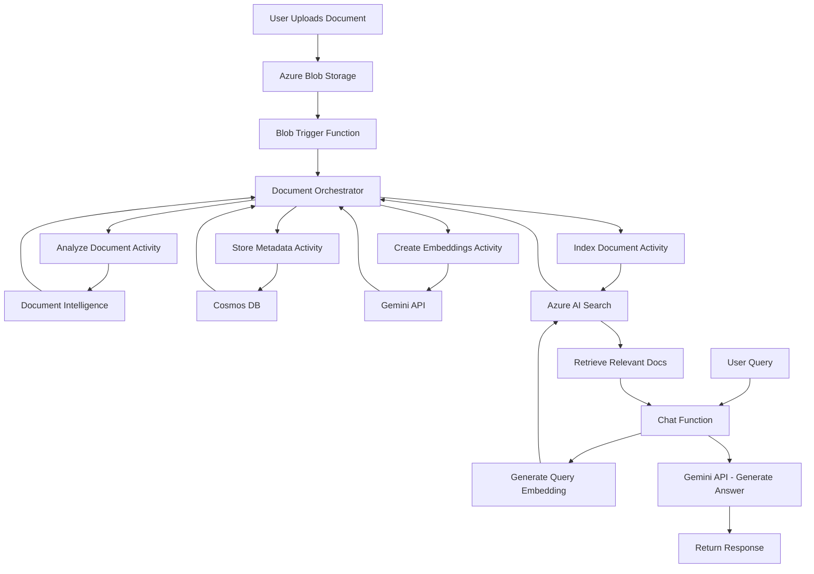

# Azure Document Classification & Chat System

A serverless document processing and RAG (Retrieval-Augmented Generation) system built with Azure Durable Functions, Document Intelligence, Azure AI Search, Cosmos DB, and Google Gemini AI.

## � Features

- **📄 Document Processing**: Automatic extraction of text from PDFs and other documents using Azure Document Intelligence
- **🔍 Vector Search**: Semantic search capabilities powered by Azure AI Search with vector embeddings
- **💬 AI Chat Interface**: Interactive chat with your documents using Google Gemini API
- **📊 Metadata Storage**: Document metadata stored in Azure Cosmos DB
- **🎯 Selective Chat**: Filter conversations by specific uploaded documents
- **🚀 Serverless Architecture**: Scalable Azure Durable Functions orchestration
- **⚡ Real-time Frontend**: Modern React application with Vite

## 🏗️ Architecture

This solution implements a complete RAG (Retrieval-Augmented Generation) pipeline:

1. **Document Upload** → HTTP endpoint or Service Bus trigger
2. **Document Analysis** → Azure Document Intelligence extracts content
3. **Metadata Storage** → Cosmos DB stores document information
4. **Embedding Generation** → Google Gemini API creates vector embeddings
5. **Vector Indexing** → Azure AI Search indexes documents with embeddings
6. **Chat Interface** → Users query documents via natural language
7. **Semantic Search** → AI Search retrieves relevant document chunks
8. **AI Response** → Gemini generates contextual answers



## 📁 Project Structure

```
DocumentClassificationProject/
├── AzureFunctions/
│   └── DocumentClassification/
│       ├── Models/                          # Data models
│       │   ├── DocumentInfo.cs
│       │   ├── EmbeddedDocument.cs
│       │   └── DocumentMetadata.cs
│       ├── Services/                        # Service layer
│       │   └── GeminiService.cs            # Gemini API integration
│       ├── BlobTriggerFunction.cs          # Blob upload trigger
│       ├── DocumentOrchestrator.cs         # Main orchestration
│       ├── AnalyzeDocumentActivity.cs      # Document Intelligence
│       ├── StoreMetadataActivity.cs        # Cosmos DB storage
│       ├── CreateEmbeddingsActivity.cs     # Embedding generation
│       ├── IndexDocumentActivity.cs        # AI Search indexing
│       ├── ChatFunction.cs                 # RAG chat endpoint
│       ├── GetDocumentsFunction.cs         # List uploaded documents
│       ├── Program.cs                      # Host configuration
│       ├── host.json                       # Functions configuration
│       └── local.settings.json             # Local settings
├── frontend/                                # React application
│   ├── src/
│   │   ├── App.jsx                         # Main app component
│   │   ├── ChatInterface.jsx               # Chat UI
│   │   ├── DocumentUpload.jsx              # Upload component
│   │   └── FileSelector.jsx                # Document selector
│   ├── package.json
│   └── vite.config.js
├── Scripts/
│   └── setup-azure-resources.sh            # Azure resource setup
└── README.md
```

## 🚀 Prerequisites

Before you begin, ensure you have:

- ✅ .NET 8 SDK
- ✅ Azure Functions Core Tools v4
- ✅ Node.js 18+ and npm
- ✅ Azure CLI
- ✅ Active Azure subscription
- ✅ Google Gemini API key (free tier available)

### Install Prerequisites

```bash
# Install .NET 8 SDK
sudo snap install dotnet-sdk --classic --channel=8.0

# Install Node.js (Ubuntu/Debian)
curl -fsSL https://deb.nodesource.com/setup_18.x | sudo -E bash -
sudo apt-get install -y nodejs

# Install Azure Functions Core Tools
npm install -g azure-functions-core-tools@4 --unsafe-perm true

# Install Azure CLI
curl -sL https://aka.ms/InstallAzureCLIDeb | sudo bash

# Install Azurite (local storage emulator)
npm install -g azurite
```

## ⚙️ Setup

### 1. Clone the Repository

```bash
git clone <your-repo-url>
cd DocumentClassificationProject
```

### 2. Create Azure Resources

```bash
# Login to Azure
az login

# Run the setup script
cd Scripts
chmod +x setup-azure-resources.sh
./setup-azure-resources.sh
```

The script will create:
- Resource Group
- Storage Account with blob container
- Cosmos DB with database and container
- Document Intelligence resource
- Azure AI Search service
- Service Bus namespace with queue

**Important**: Save the output! It contains connection strings you'll need.

### 3. Get Gemini API Key

1. Visit [Google AI Studio](https://aistudio.google.com/app/apikey)
2. Create a new API key
3. Save it for the next step

### 4. Configure Backend Settings

Update `AzureFunctions/DocumentClassification/local.settings.json`:

```json
{
  "IsEncrypted": false,
  "Values": {
    "AzureWebJobsStorage": "UseDevelopmentStorage=true",
    "FUNCTIONS_WORKER_RUNTIME": "dotnet-isolated",
    "CosmosDBConnectionString": "YOUR_COSMOS_CONNECTION_STRING",
    "CosmosDBDatabaseName": "DocumentClassificationDB",
    "CosmosDBContainerName": "documents",
    "DocumentIntelligenceEndpoint": "YOUR_DOC_INTELLIGENCE_ENDPOINT",
    "DocumentIntelligenceKey": "YOUR_DOC_INTELLIGENCE_KEY",
    "SearchServiceEndpoint": "YOUR_SEARCH_ENDPOINT",
    "SearchServiceAdminKey": "YOUR_SEARCH_ADMIN_KEY",
    "GeminiApiKey": "YOUR_GEMINI_API_KEY",
    "ServiceBusConnectionString": "YOUR_SERVICE_BUS_CONNECTION_STRING",
    "DocumentQueueName": "document-queue"
  }
}
```

### 5. Build Backend

```bash
cd AzureFunctions/DocumentClassification
dotnet restore
dotnet build
```

### 6. Setup Frontend

```bash
cd frontend
npm install
```

Update `frontend/src/config.js` with your Function App URL (use `http://localhost:7071` for local development).

## 🧪 Local Development

### Start Azurite (Terminal 1)

```bash
mkdir -p ~/azurite-data
azurite --silent --location ~/azurite-data
```

Keep this terminal running.

### Run Azure Functions (Terminal 2)

```bash
cd AzureFunctions/DocumentClassification
func start
```

You should see:

```
Functions:
  BlobTriggerFunction: blobTrigger
  DocumentOrchestrator: orchestrationTrigger
  Chat: [POST] http://localhost:7071/api/Chat
  GetDocuments: [GET] http://localhost:7071/api/GetDocuments
  AnalyzeDocumentActivity: activityTrigger
  CreateEmbeddingsActivity: activityTrigger
  IndexDocumentActivity: activityTrigger
  StoreMetadataActivity: activityTrigger
```

### Run Frontend (Terminal 3)

```bash
cd frontend
npm run dev
```

Open your browser to `http://localhost:5173`

## 📊 Using the Application

### Upload Documents

1. Use the frontend Upload section
2. Select a PDF or document file
3. Click Upload
4. Wait for processing to complete (check Azure Functions logs)

### Chat with Documents

1. Type your question in the chat interface
2. Optionally select specific documents to search
3. Click Send
4. The AI will answer based on your uploaded documents

### Example Queries

```
"What is the main topic of the invoice?"
"Summarize the key points from the contract"
"What is the total amount mentioned?"
```

## 🔧 API Endpoints

### Upload Document (via Blob Storage)
Upload files to the `documents` container in your Storage Account

### Chat
```http
POST /api/Chat
Content-Type: application/json

{
  "query": "Your question here",
  "fileNames": ["document1.pdf", "document2.pdf"]  // Optional
}
```

### Get Documents
```http
GET /api/GetDocuments
```

## 🚢 Deployment

### Deploy Backend to Azure

```bash
# Create Function App
az functionapp create \
  --name YOUR_FUNCTION_APP_NAME \
  --resource-group rg-doc-classification \
  --consumption-plan-location eastus \
  --runtime dotnet-isolated \
  --functions-version 4 \
  --storage-account YOUR_STORAGE_ACCOUNT_NAME

# Configure app settings
az functionapp config appsettings set \
  --name YOUR_FUNCTION_APP_NAME \
  --resource-group rg-doc-classification \
  --settings \
    CosmosDBConnectionString="YOUR_COSMOS_CONNECTION_STRING" \
    DocumentIntelligenceEndpoint="YOUR_DOC_INTELLIGENCE_ENDPOINT" \
    # ... add all other settings

# Deploy
cd AzureFunctions/DocumentClassification
func azure functionapp publish YOUR_FUNCTION_APP_NAME
```

### Deploy Frontend

You can deploy the frontend to:
- Azure Static Web Apps
- Vercel
- Netlify
- Azure App Service

```bash
cd frontend
npm run build
# Upload the 'dist' folder to your hosting service
```

## 🔧 Troubleshooting

### Azurite not running
```bash
azurite --silent --location ~/azurite-data
```

### Build errors
```bash
dotnet clean
dotnet restore
dotnet build
```

### Connection issues
- Verify `local.settings.json` has correct connection strings
- Check Azure resources are created and accessible
- Ensure Azurite is running for local development
- Verify CORS settings if frontend can't connect

### Document processing issues
- Check function logs for errors
- Verify Document Intelligence can access the blob URL
- Ensure the document format is supported (PDF, JPEG, PNG, etc.)

### Chat not working
- Verify Gemini API key is valid
- Check Azure AI Search index exists and has documents
- Review Chat function logs for errors
- Ensure embeddings were created successfully

## 📈 Monitoring

- **Function Logs**: Check terminal output or Azure Portal
- **Cosmos DB**: Query the `documents` container
- **Azure AI Search**: Use Search Explorer in Azure Portal
- **Application Insights**: Enable for production monitoring

## 🔒 Security Notes

- Store secrets in Azure Key Vault for production
- Use Managed Identity instead of connection strings
- Enable authentication on Function App
- Implement CORS properly for production
- Rotate API keys regularly

## 📚 Technologies Used

- **Backend**: .NET 8, Azure Durable Functions
- **Frontend**: React 18, Vite
- **AI/ML**: Google Gemini API (embeddings & chat)
- **Search**: Azure AI Search (vector search)
- **Storage**: Azure Blob Storage, Cosmos DB
- **Document Processing**: Azure Document Intelligence
- **Messaging**: Azure Service Bus

## 🗺️ Roadmap

- [ ] Add support for more document formats
- [ ] Implement user authentication
- [ ] Add document versioning
- [ ] Create document comparison feature
- [ ] Add export chat history
- [ ] Implement streaming responses
- [ ] Add multi-language support

## 🤝 Contributing

Contributions are welcome! Please feel free to submit a Pull Request.

## 📝 License

This project is for educational and demonstration purposes.

## 🔗 Resources

- [Azure Durable Functions](https://docs.microsoft.com/azure/azure-functions/durable/)
- [Azure Document Intelligence](https://docs.microsoft.com/azure/applied-ai-services/form-recognizer/)
- [Azure AI Search](https://docs.microsoft.com/azure/search/)
- [Google Gemini API](https://ai.google.dev/)
- [Azure Cosmos DB](https://docs.microsoft.com/azure/cosmos-db/)

---

Made with ❤️ using Azure and Google Gemini AI
